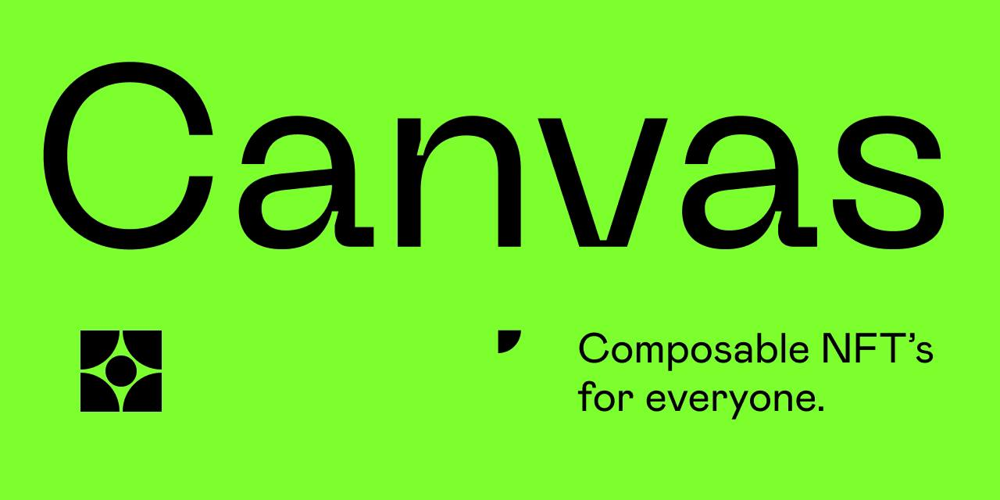

# 🖼️ NFT Canvas (:construction: WIP :construction:)
Brought to you by minds behind  **[Coinboi](coinboi.com)** and  **[Plutonians](plutonians.tech)**.

`NFT Canvas` is a Solana Protocol that facilitates two main objectives:
1. **Composing NFTs** and generating a new NFT.
2. **Deconstructing a composed NFT** and allowing the holder of the deconstructed
   NFT to redeem for the **original NFTs** that were used to create it.

### Concepts
- Never loose your underlying NFT with construction
- NFT's are stored/staked in a contract that is only redeamable via the original NFT.
- Constructed NFT's can be traded/bought/sold
- Construction (can be 1 way) set via construction options.

### Why?
We love NFT's but most of them are purely static. What if you wanted to swap out your PFP's hat for the day? or upgrade your ship's hull to make it stronger? These concepts are normal in other digital spheres but have yet to be possible with NFT's. If NFT's are really the future we need to have them be just as flexible.

Coinboi's tech was built from the beginning to be customizable, but if customizable NFT's really were the future, we couldn't keep it just to ourselves. We wanted the whole space to grow and other projects to benefit from what we're building. So we decided to open it up for the Solana and broader blockchain community. ❤️

> We truly believe that constructable/deconstructable NFT's are the next phase of growth for the ecosystem. 

## 📝  Contract Flow (in progress)

Calls to this contract will be made to initialize an account that will hold
information on what NFTs may be inputs.

1. (authority) - create the nft canvas model. this is the top level structure.
   this basically represents that nfts of a new type will be minted based on
   users' associations that they create in their own instances of this model.
   This may be the point at which a new mint account is created to represent the
   collection of nfts minted as the product of this model.
2. (authority) - declare slots. the program doesn't need to know how many there
   are.
3. (authority) - associate mints with slots
4. (authority) - declare canvas model as ready
5. (user) - create canvas instance. whoever creates the nft canvas instance will
   be its authority, once the user commits the canvas, an authorized mint will
   be created. whomever has a token account with a balance of 1 of this mint
   will be able to burn the NFT to redeem it for the nfts that were deposited.
6. (user) - deposit NFT and associate it with a slot on their canvas instance.
   This will mean that the nft canvas instance will require an associated token
   account that matches the mint of the deposited nft each time this is done.
7. (user) - remove NFT and disassociate it from their canvas instance. This
   should close the associated token account owned by the program.
8. (user) - commit their NFT canvas, locking the nft components in a vault,
   minting a new NFT. This will mark the nft canvas instance as committed and
   change the authority of the canvas to whomever holds the token minted when
   this canvas instance was committed.
9. (user) - deconstruct (burn) a composed NFT and redeem its original parts.

## How to use:

Coming soon

----

## Support Us
You can support this tech by buying NFT's from the following projects.
- [Coinboi](https://www.coinboi.com/)
- [Plutonians](https://plutonians.tech/)
- [Cryptostraps](https://www.cryptostraps.io)

We'd love to feature projects that have contributed, let us know if you'd like your project listed.

## Contribute
Join the party and submit a PR.

