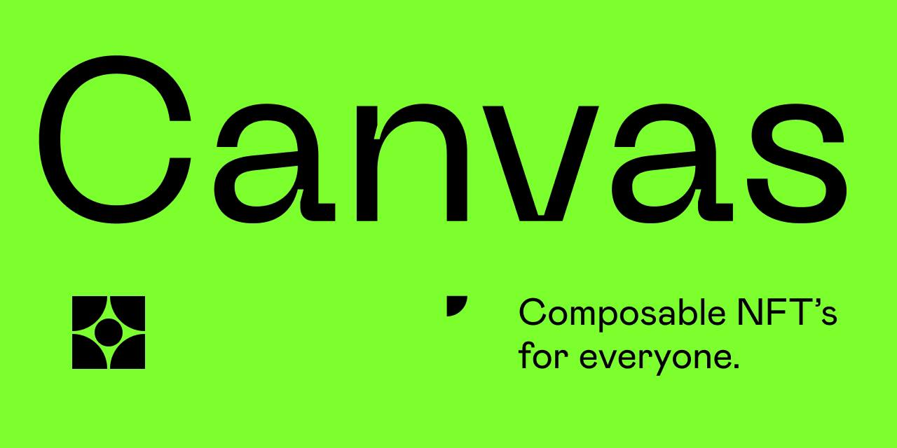

# NFT Canvas

NFT canvas will be a solana program that will facilitate two main objectives.

1. "Combining" nfts according to a recipe and generating a new NFT.
1. "Consuming" a combined / composed NFT and transferring the original NFTs that
   were used to create this composed nft to the recipient.

## Proposed flow

Calls to this contract will be made to initialize an account that will hold
information on what NFTs may be inputs.

1. (authority) - create the nft canvas model. this is the top level structure.
   this basically represents that nfts of a new type will be minted based on
   users' assosiations that they create in their own instances of this model.
   This may be the point at which a new mint account is created to represent the
   collection of nfts minted as the product of this model.
1. (authority) - declare slots. the program doesn't need to know how many there
   are.
1. (authority) - associate mints with slots
1. (authority) - declare canvas model as ready
1. (user) - create canvas instance. whover creates the nft canvas instance will
   be its authority, once the user commits the canvas, an authorized mint will
   be created. whomever has a token account with a balance of 1 of this mint
   will be able to burn the NFT to redeem it for the nfts that were deposited.
1. (user) - deposit NFT and associate it with a slot on their canvas instance.
   This will mean that the nft canvas instance will require an associated token
   account that matches the mint of the deposited nft each time this is done.
1. (user) - remove NFT and disassociate it from their canvas instance. This
   should close the associated token account owned by the program.
1. (user) - commit their NFT canvas, locking the nft components in a vault,
   minting a new NFT. This will mark the nft canvas instance as committed and

## Ideas & Questions

- Both of the identified use cases for this Program demand the ability of
  specific source NFTs to specific "positions". use PDAs to identify slots.
  Indexed PDAs (lists) are an option.
- There will need to be a way to associate different mints with slots.
- make it so the admin adds the token mint that will be used as the new NFTs'
  collection when you create the canvas model.

### Questions

- How to represent slots / list of positions that are available. -- pdas all the
  way down.
- What do we call the entire scope? -- canvas model
